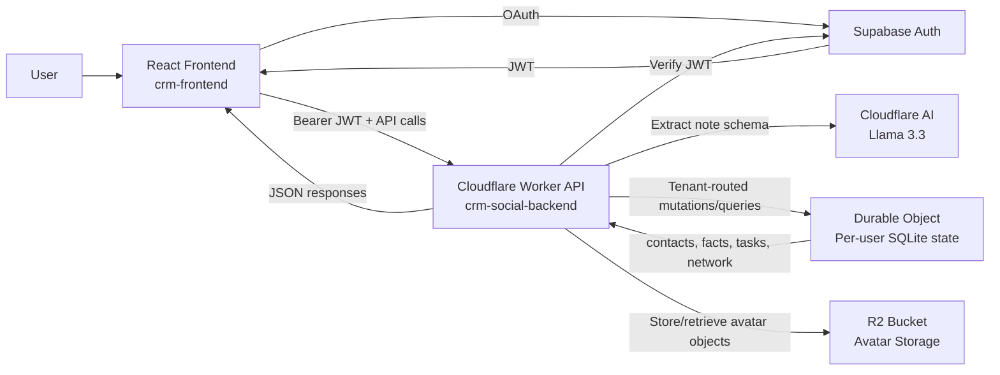
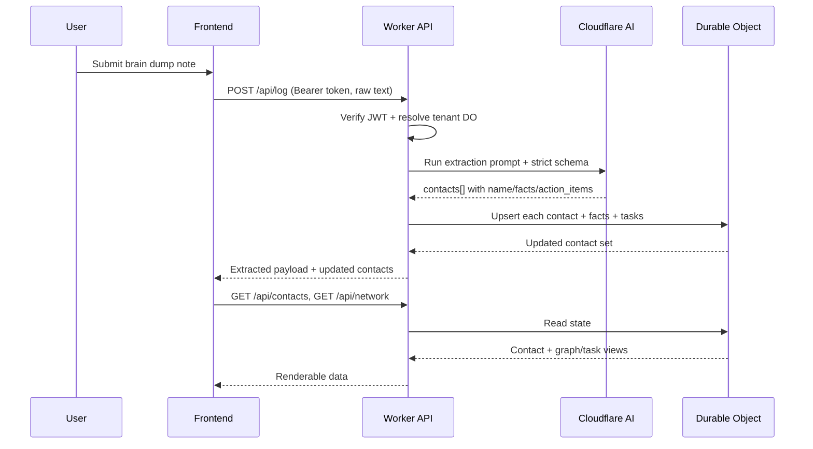

# net-pal Architecture

This repository contains a multi-tenant Personal CRM built on Cloudflare Workers + Durable Objects, with a React frontend and Supabase authentication.

## System Overview

- `crm-frontend`: React + Vite UI.
- `crm-social-backend`: Cloudflare Worker API + Durable Object state.
- Supabase Auth: OAuth login and JWT issuance.
- Cloudflare AI: Extracts structured contacts, facts, and tasks from free-form notes.
- R2: Stores avatar images.

## Architectural Flow

1. User signs in from frontend using Supabase OAuth.
2. Frontend obtains an access token and sends it as `Authorization: Bearer <token>`.
3. Worker verifies JWT (`iss`, `aud`, signature, expiry).
4. Worker resolves user-specific Durable Object by `sub` claim for strict tenant isolation.
5. For note ingestion (`POST /api/log`):
   - Worker calls Cloudflare AI with strict schema:
     - `{ "contacts": [{ "name": "string", "facts": ["string"], "action_items": ["string"] }] }`
   - Worker validates output and maps into internal records.
   - Durable Object upserts each contact independently and stores facts/tasks.
6. Frontend reads data via:
   - `GET /api/contacts` for master contact/task list.
   - `GET /api/network` for graph nodes/relationships.
7. Task completion:
   - Frontend calls `POST /api/action-items/complete`.
   - DO marks item done, frontend removes it from active TaskBoard state.
8. Contact deletion:
   - Frontend calls `DELETE /api/contacts/:contactKey`.
   - DO cascade-deletes contact, facts, and action items.
9. Avatar upload:
   - Frontend uploads image to `POST /api/upload-avatar`.
   - Worker stores file in R2, persists avatar URL on contact.

## High-Level Component Diagram

## Request Flow Diagram: Note Ingestion

## Data Boundaries

- Authentication boundary: Supabase token verification in Worker.
- Tenant boundary: one Durable Object instance per user (`sub`).
- Storage boundary:
  - Relational contact/task/fact state in DO SQLite.
  - Binary avatars in R2.
- Extraction boundary: AI only transforms note text to strict JSON; Worker validates before persistence.

## Primary API Surface

- `POST /api/log`
- `GET /api/contacts`
- `GET /api/network`
- `POST /api/action-items/complete`
- `DELETE /api/contacts/:contactKey`
- `POST /api/contact-details`
- `POST /api/upload-avatar`
- `GET /api/avatar/:key`
# net-pal

